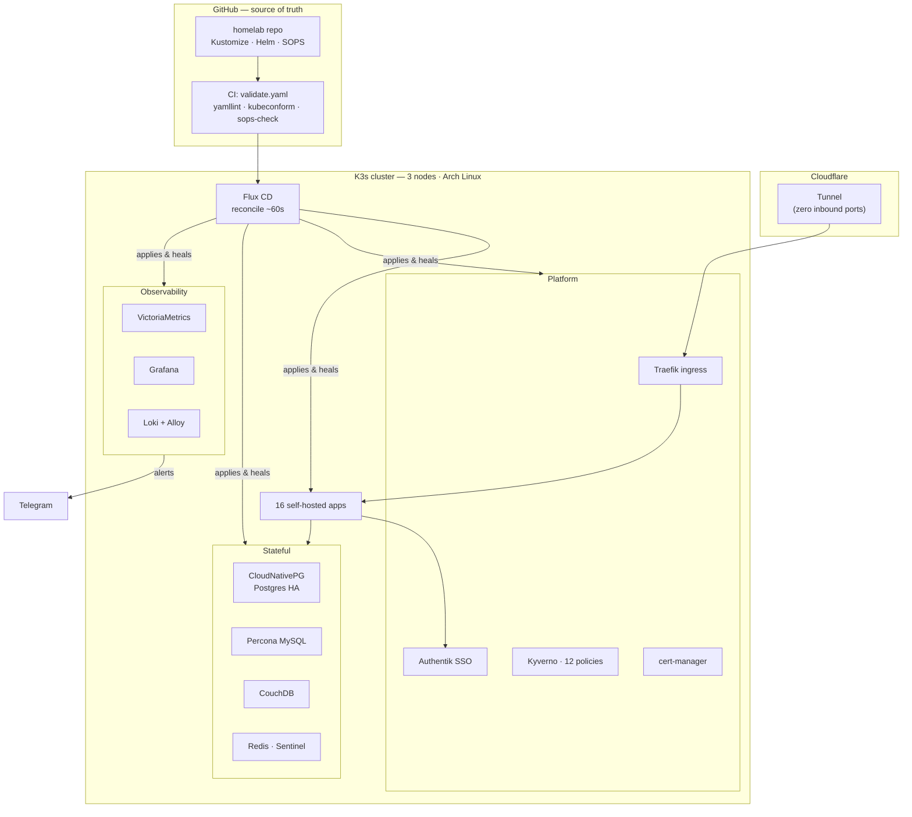

# Homelab

A fully **GitOps-managed**, 3-node **K3s** cluster running **16 self-hosted apps** — every resource declared in this repo and reconciled by [Flux](https://fluxcd.io/). Default-deny networking, enforced Pod Security Standards, SOPS-encrypted secrets, HA PostgreSQL with automated backups, and single sign-on across apps.


[](https://github.com/AKhozya/homelab/actions/workflows/validate.yaml)


> Personal homelab — run like production. No manual `kubectl apply`, every change CI-gated and policy-enforced, secrets never in plaintext. Where I deliberately cut corners, I say so → [Trade-offs](#trade-offs).

## Architecture



See [docs/ARCHITECTURE.md](docs/ARCHITECTURE.md) for the full design, principles, and component map.

## Highlights

- **100% declarative.** The repo *is* the cluster. Flux reconciles Git every ~60s; drift self-heals. Nothing is changed by hand.
- **Policy-enforced security.** 12 Kyverno `ClusterPolicy` resources block privilege escalation, root, writable root filesystems, missing seccomp, unpinned images, and un-isolated workloads — in *enforce* mode.
- **Default-deny networking.** Every ingress is paired with an explicit `NetworkPolicy`. No pod talks to another unless declared.
- **Zero inbound ports.** External access rides a Cloudflare Tunnel; the home network exposes nothing.
- **HA data + real backups.** PostgreSQL runs primary+replica via CloudNativePG, with automated daily logical backups and a documented restore path.
- **Single sign-on.** Authentik fronts apps via forward-auth and OIDC.
- **Automated upkeep.** Renovate proposes pinned dependency bumps; a CI gate validates every push before Flux ever sees it.

## Tech stack

| Layer | Tools |
|---|---|
| **Platform** | K3s (lightweight Kubernetes), containerd |
| **GitOps** | Flux CD, Kustomize, Helm, Renovate |
| **Ingress & DNS** | Traefik, Cloudflare Tunnel, Blocky (DNS + ad-block), cert-manager (TLS) |
| **Databases** | CloudNativePG (Postgres HA), Percona (MySQL), CouchDB, Redis (Sentinel) |
| **Observability** | VictoriaMetrics, Grafana, Loki + Grafana Alloy, Popeye, Alertmanager → Telegram |
| **Security** | Kyverno, Pod Security Standards, NetworkPolicies, SOPS + age, Authentik (SSO) |
| **Backup / DR** | CloudNativePG logical backups, off-node replication, documented restore runbook |

## Hardware

| Node | Role | IP | Notes |
|---|---|---|---|
| `gmk-k3s-control-plane` | control-plane | 192.168.1.127 | API server, scheduler, etcd |
| `worker-node` | worker | 192.168.1.129 | workloads + Postgres replica |
| `worker-node-2` | worker | 192.168.1.126 | workloads |

Arch Linux on all three; SSH on a non-default port; static DHCP leases.

## Applications

| App | Purpose | Category |
|---|---|---|
| [Authentik](apps/authentik) | Identity provider — SSO / OIDC for the cluster | Identity |
| [Home Assistant](apps/home-assistant) | Home automation hub | Smart home |
| [Immich](apps/immich) | Photo & video backup | Media |
| [Audiobookshelf](apps/audiobookshelf) | Audiobook & podcast server | Media |
| [Paperless-NGX](apps/paperless-ngx) | Document archive with OCR | Productivity |
| [Obsidian](apps/obsidian) | Notes sync (CouchDB LiveSync) | Productivity |
| [Linkwarden](apps/linkwarden) | Bookmark & link archive | Productivity |
| [Mealie](apps/mealie) | Recipe manager & meal planner | Productivity |
| [n8n](apps/n8n) | Workflow automation | Automation |
| [Homepage](apps/homepage) | Services dashboard (widgets, health) | Dashboard |
| [HomeHub](apps/homehub) | Personal start page / bookmarks | Dashboard |
| [Stirling-PDF](apps/stirling-pdf) | PDF toolkit | Utility |
| [PriceBuddy](apps/pricebuddy) | Price tracker | Utility |
| [Uptime Kuma](apps/uptime-kuma) | Uptime / status monitoring | Monitoring |
| [Blocky](apps/blocky) | DNS resolver + ad-blocking | Networking |
| [claude-telegram](apps/claude-telegram) | Telegram bridge for ops alerts & control | Ops |

Select apps are reachable from the internet via the Cloudflare Tunnel; the rest are LAN-only. Both paths terminate at Traefik.

## How GitOps works here

Flux watches `main`. On each change it renders the Kustomize/Helm tree and applies it, health-gating dependents so nothing reconciles before its prerequisites are `Ready`. The dependency graph (`clusters/`):

```
flux-system  (Git source)
└─ infrastructure-controllers      cert-manager · Kyverno · Traefik · DB operators · priority classes
   ├─ coredns
   ├─ infrastructure-configs       Kyverno policies · DB clusters · certs · Cloudflare  ──▶ apps
   └─ monitoring-controllers       VictoriaMetrics · Grafana · Loki · Popeye           ──▶ monitoring-configs
```

A push runs [`validate.yaml`](.github/workflows/validate.yaml) first — yamllint, shellcheck, SOPS encryption check, init-container resource check, and `kubeconform` schema validation across all five Kustomize roots (~45s) — so broken manifests never reach the cluster.

## Repository layout

```
.
├── apps/             16 self-hosted applications (one directory each)
├── infrastructure/   controllers (operators, ingress, policy) + configs (DBs, certs, policies)
├── monitoring/       observability stack — metrics, logs, dashboards, alerts
├── clusters/         Flux entrypoint — Kustomization DAG + bootstrap
├── docs/             architecture, security, backup/DR, runbooks
└── .backup/          disaster-recovery runbook + restore tooling
```

## Security posture

- **Pod Security Standards** enforced; workloads run non-root with read-only root filesystems and all capabilities dropped.
- **12 Kyverno policies** in enforce mode (non-root, read-only rootfs, drop-all-caps, seccomp `RuntimeDefault`, resource limits, image-pin, required NetworkPolicy, non-default ServiceAccount, no host namespaces/paths).
- **Default-deny NetworkPolicies** — every ingress has a matching policy; DNS egress is a shared component.
- **SOPS + age** encrypt every secret at rest; CI fails the build if a plaintext secret is committed.
- **No inbound ports** — external access only through the Cloudflare Tunnel.
- **SSO** via Authentik (forward-auth + OIDC).

Details in [docs/SECURITY.md](docs/SECURITY.md) and [docs/FIREWALL_SECURITY.md](docs/FIREWALL_SECURITY.md).

## Screenshots

<!-- Drop dashboard screenshots into docs/images/ and uncomment: -->
<!--  -->
<!--  -->

_Grafana and Homepage dashboards — screenshots to come._

## Documentation

| Doc | What's in it |
|---|---|
| [ARCHITECTURE.md](docs/ARCHITECTURE.md) | Design, principles, component map, mermaid diagrams |
| [SECURITY.md](docs/SECURITY.md) | Security model, controls, threat surface |
| [FIREWALL_SECURITY.md](docs/FIREWALL_SECURITY.md) | Host firewall + NetworkPolicy two-layer model |
| [BACKUP_STRATEGY.md](docs/BACKUP_STRATEGY.md) | Backup cadence, retention, RTO/RPO, restore |
| [disaster-recovery/](docs/disaster-recovery) | DR runbooks |
| [SECRETS_ROTATION.md](docs/SECRETS_ROTATION.md) | Rotation schedule + SOPS/age model |
| [CODEMAPS/](docs/CODEMAPS) | Structural snapshots of each subsystem |
| [HOMELAB_HISTORY.md](docs/HOMELAB_HISTORY.md) | Milestones + change log |

## Trade-offs

Honest about what's *not* gold-plated, because the choices were deliberate:

- **Not everything is HA.** Postgres runs primary+replica; single-instance stateful apps (e.g. CouchDB) accept a short restore window instead of replication.
- **Single control-plane node.** No etcd quorum — fine for a personal cluster, and the whole thing is rebuildable from Git + backups.
- **Logical backups, not PITR.** `pg_dump`-style backups over continuous WAL archiving — right-sized for homelab data volumes ([rationale](docs/BACKUP_STRATEGY.md)).

---

Built and operated as a learning ground for production-grade Kubernetes, GitOps, and platform security.
