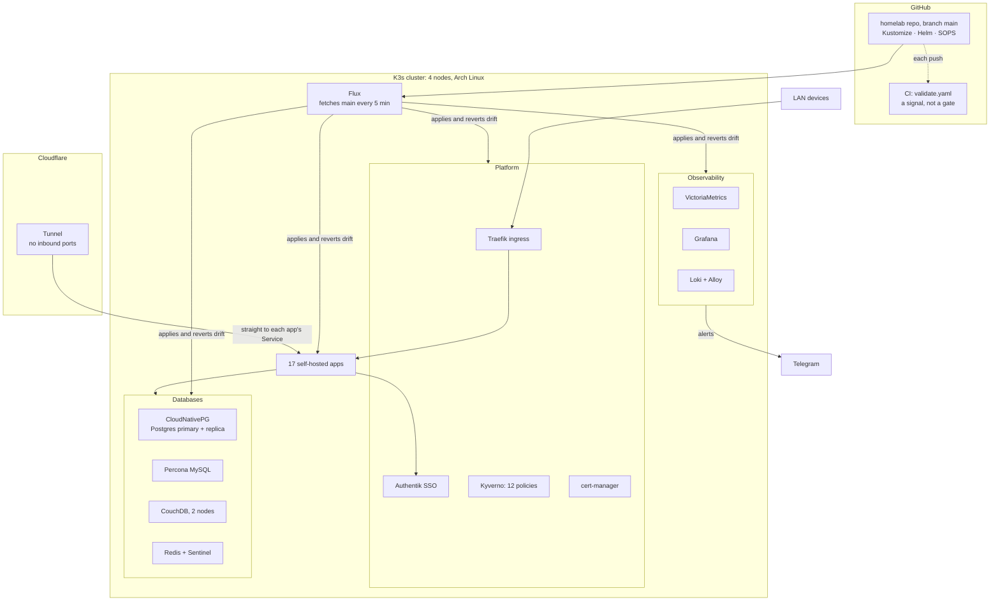

# Homelab

This repo runs a 4-node **K3s** cluster at home with **17 self-hosted apps**. Every resource in the
cluster is declared here, and [Flux](https://fluxcd.io/) applies what this repo says. The cluster is
the owner's production: there is no staging copy, so a merge to `main` goes live.


[](https://github.com/AKhozya/homelab/actions/workflows/validate.yaml)


No one changes the cluster by hand. Secrets sit in the repo, encrypted. Admission policies (checks
the Kubernetes API runs before it accepts a workload) reject workloads that break the rules.
[Trade-offs](#trade-offs) lists the limits the owner accepts on purpose.

## Architecture



[docs/ARCHITECTURE.md](docs/ARCHITECTURE.md) explains the design and the reasons behind it.

## Highlights

| Area | What it means here |
|---|---|
| Declarative | The repo describes the whole cluster. Flux fetches `main` every 5 minutes and puts back anything changed by hand. |
| Admission policy | 12 Kyverno policies reject a workload that runs as root, escalates privileges, writes its root filesystem, skips seccomp (the kernel's system-call filter), uses the `:latest` tag or no tag, or sits in an app namespace without a NetworkPolicy. All 12 deny; none only warns. |
| Network | Every app namespace has NetworkPolicies, and Kyverno rejects a workload in an app namespace without one. Each app's policy lists the connections it allows in and out. If NetworkPolicies select a pod for incoming or outgoing traffic, they block connections in that direction unless at least one policy allows them. Each Ingress has a matching NetworkPolicy rule. |
| No inbound ports | Internet traffic comes in through a Cloudflare Tunnel, which the cluster opens from the inside. The home router forwards nothing. |
| Databases and backups | Postgres runs a primary and a replica. Every night, jobs export Postgres, MySQL, CouchDB and the app volumes, and a 03:30 job copies the backups to a NAS. A [runbook](docs/disaster-recovery/README.md) covers a full restore. |
| Single sign-on | Authentik signs users in to the apps. Most apps use OIDC (the app hands sign-in to Authentik); Homepage sits behind forward-auth (Traefik asks Authentik before it passes each request on). |
| Upkeep | Renovate opens pull requests for dependency updates. CI checks each push but does not block a merge; see [Trade-offs](#trade-offs). |

## Tech stack

| Layer | Tools |
|---|---|
| Platform | K3s (a small Kubernetes distribution), containerd |
| GitOps | Flux, Kustomize, Helm, Renovate |
| Ingress and DNS | Traefik, Cloudflare Tunnel, Blocky (DNS with ad-blocking), cert-manager (TLS) |
| Databases | CloudNativePG (Postgres), Percona (MySQL), CouchDB, Redis with Sentinel |
| Observability | VictoriaMetrics, Grafana, Loki with Grafana Alloy, Popeye, Alertmanager to Telegram |
| Security | Kyverno, Pod Security Standards, NetworkPolicies, SOPS with age, Authentik |
| Backup | Nightly database exports and volume backups, a nightly copy to the NAS, a restore runbook |
| Nodes | Arch Linux, configured by the Ansible roles in [node-maintenance/](node-maintenance/) |

## Hardware

| Node | Role | IP | Notes |
|---|---|---|---|
| `gmk-k3s-control-plane` | control plane | 192.168.1.127 | API server and scheduler; K3s keeps cluster state in SQLite |
| `worker-node` | worker | 192.168.1.129 | most app volumes; preferred node for the Postgres primary (a failover moves it) |
| `worker-node-2` | worker | 192.168.1.126 | workloads; metrics storage |
| `immich-vm` | GPU worker | 192.168.1.231 | Arch VM on the NAS with the Intel GPU passed through for Immich's video transcoding (Intel QSV); runs Immich and the per-node agents only |

| Shared by all four nodes | |
|---|---|
| OS | Arch Linux |
| SSH | accepts connections on a non-default port |
| Addresses | fixed, from DHCP reservations |

## Applications

| App | Purpose | Category |
|---|---|---|
| [Authentik](apps/authentik) | Identity provider: single sign-on for the other apps | Identity |
| [Home Assistant](apps/home-assistant) | Home automation hub | Smart home |
| [Immich](apps/immich) | Photo and video backup | Media |
| [Audiobookshelf](apps/audiobookshelf) | Audiobook and podcast server | Media |
| [Paperless-NGX](apps/paperless-ngx) | Document archive with OCR | Productivity |
| [Obsidian](apps/obsidian) | Notes sync (CouchDB LiveSync) | Productivity |
| [Linkwarden](apps/linkwarden) | Bookmark and link archive | Productivity |
| [Mealie](apps/mealie) | Recipe manager and meal planner | Productivity |
| [n8n](apps/n8n) | Workflow automation | Automation |
| [Homepage](apps/homepage) | Services dashboard | Dashboard |
| [HomeHub](apps/homehub) | Family start page | Dashboard |
| [Stirling-PDF](apps/stirling-pdf) | PDF toolkit | Utility |
| [PriceBuddy](apps/pricebuddy) | Price tracker | Utility |
| [Uptime Kuma](apps/uptime-kuma) | Uptime monitoring | Monitoring |
| [Blocky](apps/blocky) | DNS resolver with ad-blocking | Networking |
| [RustDesk](apps/rustdesk) | Self-hosted remote desktop relay | Networking |
| [claude-telegram](apps/claude-telegram) | Telegram bot for ops alerts and control | Ops |

Nine apps are also reachable from the internet through the Cloudflare Tunnel; the rest are LAN-only.
LAN traffic goes through Traefik. Tunnel traffic skips Traefik and goes straight to each app's
Service, so Traefik's middleware (security headers, rate limits, CSP) applies to LAN traffic only.

## How GitOps works here

Flux watches `main`. It fetches the branch every 5 minutes, then builds the Kustomize and Helm tree
and applies it. A Flux Kustomization (one unit that Flux applies) waits until the ones it depends on
report Ready before Flux applies it. The dependencies, from `clusters/`:

```
flux-system  (Git source)
└─ infrastructure-controllers      cert-manager · Kyverno · Traefik · DB operators · priority classes
   ├─ coredns
   ├─ infrastructure-configs       Kyverno policies · DB clusters · certs · Cloudflare  ──▶ apps
   └─ monitoring-controllers       VictoriaMetrics · Grafana · Loki · Popeye           ──▶ monitoring-configs
```

Each push runs [`validate.yaml`](.github/workflows/validate.yaml):

| Job | Checks |
|---|---|
| yamllint | YAML syntax and style |
| shellcheck | shell scripts |
| sops-check | every Secret is SOPS-encrypted |
| init-resources | every init container sets resource limits |
| image-pin | no image uses a floating tag |
| kubeconform | manifest schemas, across all seven Kustomize roots |
| helm-render | every HelmRelease chart renders at its pinned version |
| homelab-analysis-drift | key numbers in `docs/HOMELAB_ANALYSIS.md` still match the repo (warn-only) |

CI is a signal, not a merge gate. Flux applies `main` whatever CI reports, because a private repo on
GitHub's Free plan cannot use branch protection. No Actions job has started since 2026-09-10,
because of a billing problem on the account.

## Repository layout

```
.
├── apps/               17 self-hosted apps, one directory each
├── infrastructure/     operators, ingress and policy (controllers); databases, certs and policies (configs)
├── monitoring/         metrics, logs, dashboards and alerts
├── clusters/           Flux entry point: the Kustomization graph and bootstrap
├── node-maintenance/   Ansible roles and systemd units that configure and update the nodes
├── scripts/            node setup and repo helper scripts
├── agents/             read-only copy of the AI agent skills and rules used to run the cluster
├── docs/               architecture, security, backup and restore, runbooks
└── .backup/            restore and secrets scripts used by the DR runbook
```

## Security posture

| Control | What it does |
|---|---|
| Pod Security Standards | Every namespace enforces a level, except `default`, `flux-system` and the three `kube-*` system namespaces: `restricted` where the workload allows it, `baseline` or `privileged` where it needs more. [Home Assistant](apps/home-assistant/PSS_EXCEPTION.md) and [Stirling-PDF](apps/stirling-pdf/PSS_EXCEPTION.md) have their exceptions written up. |
| Kyverno | 12 policies, all `Deny`: non-root, read-only root filesystem, drop all capabilities, seccomp `RuntimeDefault`, resource limits, no `:latest` tag, a NetworkPolicy present, required labels, a non-default ServiceAccount, no host namespaces, no hostPath, no privilege escalation. |
| NetworkPolicies | Every app namespace has them. DNS egress comes from one shared component. |
| SOPS and age | Every secret in the repo is encrypted. CI and a pre-commit hook check that. |
| Cloudflare Tunnel | The only way in from the internet; no inbound ports. |
| Authentik | Single sign-on, by OIDC or forward-auth; sign-in is passkey-first. |

A few workloads cannot meet every policy. For example, Home Assistant and Stirling-PDF run as root.
The [security page](docs/SECURITY.md) and the [host firewall page](docs/FIREWALL_SECURITY.md)
cover the details.

## Screenshots

<!-- Drop dashboard screenshots into docs/images/ and uncomment: -->
<!--  -->
<!--  -->

_Grafana and Homepage dashboards: screenshots to come._

## Documentation

| Doc | What's in it |
|---|---|
| [ARCHITECTURE.md](docs/ARCHITECTURE.md) | Design, principles, diagrams |
| [SECURITY.md](docs/SECURITY.md) | Security model and controls |
| [FIREWALL_SECURITY.md](docs/FIREWALL_SECURITY.md) | Host firewall and NetworkPolicy layers |
| [BACKUP_STRATEGY.md](docs/BACKUP_STRATEGY.md) | Backup schedule, retention, recovery targets |
| [disaster-recovery/](docs/disaster-recovery) | Full restore runbook |
| [SECRETS_ROTATION.md](docs/SECRETS_ROTATION.md) | Rotation schedule and the SOPS/age model |
| [subsystems/](docs/subsystems) | Maps of each subsystem: where things live and how they connect |
| [HOMELAB_ANALYSIS.md](docs/HOMELAB_ANALYSIS.md) | Current state and live counts |
| [HOMELAB_HISTORY.md](docs/HOMELAB_HISTORY.md) | Milestones and the change log |
| [node-maintenance/](node-maintenance/README.md) | How the nodes are configured, updated and rebooted |

## Trade-offs

| Trade-off | Why |
|---|---|
| Most apps run one pod | An app's volume lives on one node's disk. If that node fails, the app stays down until the node returns or a restore runs. Among the apps, only Authentik and Blocky run two copies; the databases, Traefik and the tunnel also run two or more. |
| One control-plane node | If it goes down, running pods and Services keep serving, but nothing new deploys until it returns. Git and the backups can rebuild the cluster. |
| CI does not gate a merge | Branch protection needs a paid plan on a private repo. Instead, a second AI model (Codex) reviews each non-trivial change before it is committed. |
| Database exports, no point-in-time recovery | Nightly `pg_dump`-style exports, not a continuous copy of the database's write log. A restore goes back to last night, not to a chosen minute. That fits the data volumes here; [BACKUP_STRATEGY.md](docs/BACKUP_STRATEGY.md) has the reasons. |
| No offsite copy | The nodes and the NAS share one building, so a fire or theft loses every copy. |

---

The owner builds and runs this cluster to learn production Kubernetes, GitOps and platform security.
