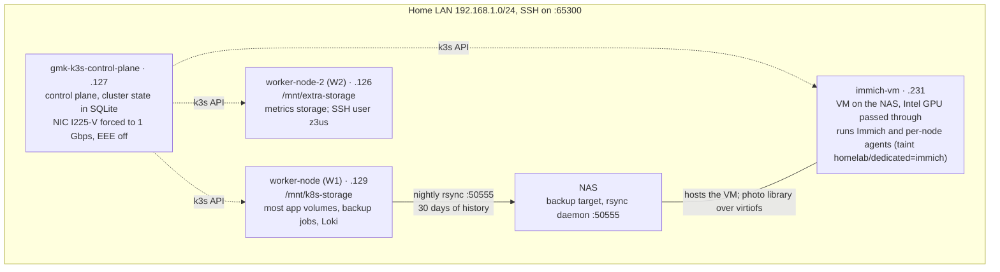
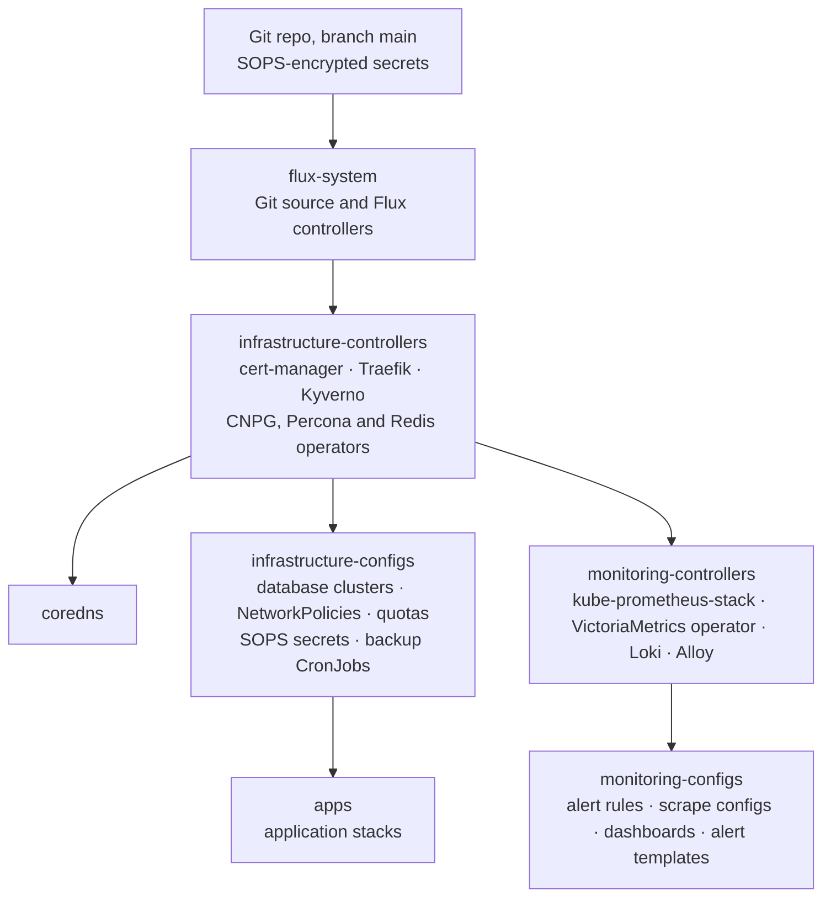
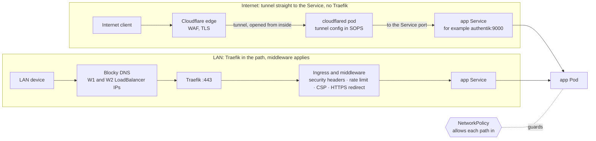
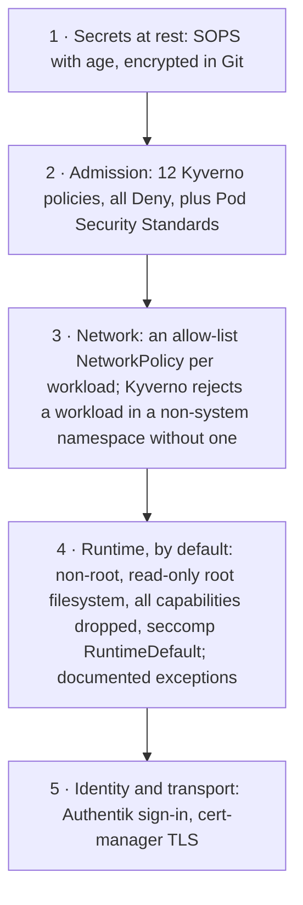

# Homelab Architecture

This page explains how the cluster is built and why. For current numbers, see
[HOMELAB_ANALYSIS.md](HOMELAB_ANALYSIS.md). For a map of each subsystem, see
[subsystems/](subsystems/). For the change log, see [HOMELAB_HISTORY.md](HOMELAB_HISTORY.md). This
page changes only when the design changes, so it avoids numbers that drift.

**In one line:** one K3s cluster, which is also production, on four Arch Linux nodes (three
physical machines and a GPU worker VM on the NAS). Git is the only way to change it, Flux applies
the changes, every secret is encrypted with SOPS, and every workload passes admission policy and
sits behind a NetworkPolicy.

---

## Design principles

| # | Principle | Why | Cost |
|---|---|---|---|
| 1 | **Git is the only source of truth.** Nobody runs `kubectl edit`, `patch` or `apply` against live objects; the cluster is whatever `main` says. | The cluster can be rebuilt from the repo, `git log` is the audit trail, and Flux reverts a hand-made change on its next run. | No emergency change made straight to the cluster. A fix is a commit; Flux fetches `main` every 5 minutes and applies it once each dependency reports Ready. |
| 2 | **Infrastructure before apps.** Flux `dependsOn` orders the Kustomizations (the units Flux applies): CRDs (custom resource types) before the resources that use them, operators before what they manage, databases before the apps that connect. | Flux applies the apps only after the infrastructure they need reports Ready. | A broken layer holds back every layer that depends on it. |
| 3 | **Secrets live in Git, encrypted.** SOPS with age encrypts each secret in the repo; only the cluster's age key decrypts them. | One source of truth, reviewable in a diff, and no external secret store to bootstrap. | Losing the age key makes every encrypted secret unreadable (see [Failure modes](#failure-modes)). |
| 4 | **Several independent layers of defence.** Admission policy, NetworkPolicies, container runtime limits and sign-in each assume the others may fail. | A compromised app still meets a NetworkPolicy, a non-root container with a read-only filesystem, and enforced limits. | A few apps need exceptions, each documented. |
| 5 | **Two ways in, no open ports.** LAN traffic goes through Blocky DNS to Traefik. Internet traffic comes only through a Cloudflare Tunnel, which the cluster opens from the inside. | The home router forwards nothing inbound. | Tunnel traffic skips Traefik, so Traefik's middleware does not apply to it. |
| 6 | **Pin everything; name things after what they are.** Images are pinned to `major.minor.patch-variant`. A database role has the app's name. | Floating tags change without a commit. Predictable names let people and policies find things without a lookup. | Every version bump is an explicit change; Renovate proposes them. |

---

## Node topology and storage

Storage is `local-path-provisioner`: each volume lives on one node's disk. There is no distributed
storage layer, by choice: node-local disks are simpler and faster. The volume's `nodeAffinity`
binds it to the node where it was first created, so its pod always runs there. Most Deployments
carry no node rule of their own; these do:

| Workload | Node rule |
|---|---|
| `blocky` | required: `worker-node` or `worker-node-2` |
| `rustdesk`, `warp-beacon` | required: `worker-node` |
| `uptime-kuma` | `nodeSelector`: the control plane |
| `immich-server`, `immich-machine-learning` | `nodeSelector`: `homelab/gpu=intel` (`immich-vm`) |

Durability comes from the backup chain, not from replicas: one CronJob on W1 copies the nightly
backups to the NAS and keeps 30 days of history.

Immich runs on `immich-vm`, the GPU worker:

| Part | Where | Since |
|---|---|---|
| immich-server | `immich-vm`, using the Intel GPU for video transcoding | 2026-07-12 |
| Immich machine learning | `immich-vm`, with OpenVINO on the same GPU; model cache in a PVC (persistent volume claim: a pod's request for storage) declared in Git, on the VM's local-path disk | 2026-09-06 |
| Photo library | NAS storage, shared into the VM over virtiofs and mounted into the pod as a `hostPath` volume (a directory on the node) | 2026-07-12 |
| Weekly library backup | `immich-backup` on W2: it pulls the library from the NAS, writes a tar on W2 and a copy to the NAS `akhozya-pool1` pool, and keeps two of each | 2026-07-14 |

The taint `homelab/dedicated=immich:NoSchedule` keeps every other workload off `immich-vm`, apart
from the per-node agents.

---

## GitOps reconciliation order

`flux-system` is the Git source. `infrastructure-controllers` is the root Kustomization, and three
branches start from it: DNS, the infrastructure configs (then the apps), and monitoring.

The first two arrows show where Flux gets the source. Each arrow below `infrastructure-controllers`
is a Flux `dependsOn`: a Kustomization waits until its parent reports Ready. If their parents are
Ready, the apps branch and the monitoring branch run in parallel. `apps` sets
`wait: false`, so Flux does not wait for every app to become healthy; each app reports its own
readiness.

| Kustomization | Depends on | Owns |
|---|---|---|
| `infrastructure-controllers` | flux-system (source) | Operators and CRDs: cert-manager, Traefik, Kyverno, CNPG, Percona, Redis |
| `coredns` | infrastructure-controllers | Cluster DNS |
| `infrastructure-configs` | infrastructure-controllers | Database clusters, NetworkPolicies, quotas, secrets, backups |
| `apps` | infrastructure-configs | The 17 app stacks; their databases and NetworkPolicies must exist first |
| `monitoring-controllers` | infrastructure-controllers | VictoriaMetrics, Loki, Alloy |
| `monitoring-configs` | monitoring-controllers | Scrape configs, alert rules, dashboards, alert templates |

**Where a database goes.** A CNPG `Database` resource is infrastructure, not app config. It lives in
`infrastructure-configs`, in the `databases` namespace next to its `Cluster`, because its
`spec.cluster` can only point to a cluster in the same namespace. That is why database manifests
sit under `infrastructure/configs/databases/postgres/`, not in the app directories.

---

## Traffic flow: two ways in

An app that is reachable both ways has two ingress rules in its NetworkPolicy: one from Traefik and
one from the tunnel. cert-manager issues one TLS certificate per ingress hostname under `h0melab.work`, through a DNS-01
challenge with a Cloudflare API token.

**Traefik middleware applies only on the LAN path.** The `cloudflared` NetworkPolicy
(`infrastructure/configs/cloudflare/networkpolicy.yaml`) lets the tunnel reach each app's
Service port directly. It has no egress to the `traefik` namespace:

| cloudflared may reach | Why |
|---|---|
| 8 app namespaces: audiobookshelf, authentik, immich, linkwarden, mealie, n8n, paperless-ngx, stirling-pdf | their tunnel hostnames |
| `databases` | CouchDB, for Obsidian sync |
| `rustdesk` | RustDesk clients on Cloudflare WARP (Cloudflare's device VPN) |
| `kube-system` | DNS |

So internet visitors get Cloudflare's WAF (web application firewall) and TLS, but not Traefik's
CSP, security headers or rate limits; they see whatever CSP the app sets.

**Cloudflare Access, per hostname.** Access policies live in the Cloudflare account, not in this
repo, so nothing here can check them for drift. This table records what was decided and why.

| Tunnel hostname | Edge gate | Reason |
|---|---|---|
| `couchdb` | Cloudflare Access, **Service Auth** action | Obsidian LiveSync is a headless client with a shared CouchDB password and no sign-in page, so the edge has to authenticate it. Use the `Service Auth` action, not `Allow`, and keep `Use Internal API` off. |
| `authentik` | none, by design | It is the identity provider; a gate at the edge would lock every other app out of its sign-in. Sign-in is passkey-first, with no password. |
| `audiobooks`, `immich`, `linkwarden`, `mealie`, `n8n`, `paperless`, `stirling` | none; each app signs users in through Authentik (OIDC) | A gate at the edge would add a second prompt without adding a factor. **Accepted cost:** each app's own sign-in page faces the internet, so a bug in its sign-in is exposed to the internet, not only to the LAN. |

If you add a tunnel hostname, pick one of these three rows and add the hostname to it. The Access
policies are not stored in this repo, so a Git diff cannot show a change to them.

---

## Security layers

Each layer works on its own. A workload that got past admission still meets the network policy. A
process that got past the network policy still runs, by default, as non-root with a read-only root
filesystem, no extra Linux privileges (capabilities) and the default system-call filter (seccomp).
These run a container as root, or may:

| Workload | Container | Why |
|---|---|---|
| Home Assistant | main | documented exception ([PSS_EXCEPTION.md](../apps/home-assistant/PSS_EXCEPTION.md)) |
| Stirling-PDF | main | documented exception ([PSS_EXCEPTION.md](../apps/stirling-pdf/PSS_EXCEPTION.md)) |
| Paperless-NGX | init `fix-permissions` | `runAsUser: 0`, to fix volume ownership |
| PriceBuddy | `pricebuddy`, `scraper` | no user set, so they run as the image's user |

The Kyverno non-root policy (`require-non-root-vp.yaml`) excludes all four namespaces.

| Control | Scope |
|---|---|
| Pod Security Standards | Sets the floor for each namespace: `restricted` where possible, `baseline` or `privileged` only where a workload needs hostPath, host namespaces, extra capabilities or a GPU. [Home Assistant](../apps/home-assistant/PSS_EXCEPTION.md) and [Stirling-PDF](../apps/stirling-pdf/PSS_EXCEPTION.md) have their exceptions written up. |
| Kyverno | Checks what PSS cannot: no `:latest` tag or missing tag, resource limits on every container (init containers too), a NetworkPolicy in the namespace. Kyverno CEL `ValidatingPolicy` resources have been the only policy engine since 2026-07-12. |
| NetworkPolicy ports | Name the container port, not the Service port. |

---

## Data layer

| Engine | Operator | Notes |
|---|---|---|
| PostgreSQL | CloudNativePG (`main-postgres`) | One shared cluster, primary and replica. Each app gets a role from `managed.roles` and a `Database` resource; the role has the app's name. A PgBouncer pooler sits in front and reuses database connections. |
| MySQL | Percona | Primary and replica, HAProxy in front. The operator has no user resource, so app users come from SQL. |
| CouchDB | Helm chart | Two nodes; serves Obsidian sync. |
| Redis | OT operator | In memory, with Sentinel. Authentik uses Postgres only. |

Backups run from CronJobs in `infrastructure-configs`, every night (UTC):

| Job | Time |
|---|---|
| Postgres export | 03:00 |
| CouchDB export | 03:05 |
| App volume backup | 03:10 |
| MySQL export | 03:15 |
| Copy to the NAS, from W1 (30 days of history) | 03:30 |

The DR runbook is
[disaster-recovery/README.md](disaster-recovery/README.md). Never force-delete a database pod or
drop a database by hand; change the resource in Git, then `kubectl rollout restart`.

---

## Failure modes

| Failure | Effect | What still works | Recovery |
|---|---|---|---|
| Control-plane node down | Flux and admission stop; new pods cannot be scheduled | Running pods and Services keep serving; kube-proxy on the workers does not need the control plane | Reboot the node; Flux catches up |
| `worker-node` (W1) down | Most app volumes, the five nightly backup CronJobs (pinned to W1) and Loki are on W1, so most stateful apps, logs and the nightly backups stop. Nothing fails over, because each volume is bound to W1's disk. | Workloads on other nodes; metrics and alerts (on W2); Immich (on `immich-vm`); the weekly Immich backup (on W2) | Reboot or replace W1; apps and backups resume |
| `immich-vm` down | Immich web, API and machine learning stop | Everything else. Immich data is safe: the library is on the NAS and the database is in CNPG. | If the VM is shut off, the `immich-vm-heal` CronJob starts it. If the VM hangs while running, the operator steps in; never `virsh destroy` it (the GPU does not reset cleanly). |
| `worker-node-2` (W2) down | Metrics and in-cluster alerting stop: the single VictoriaMetrics instance keeps its volume on W2. The always-firing Watchdog alert then stops, so healthchecks.io stops receiving pings and raises an alert from outside the cluster. | Apps, logs and backups on W1 | Reboot or replace W2; monitoring resumes |
| Cloudflare edge or tunnel down | Apps published on the tunnel are unreachable from the internet | LAN access through Traefik | Wait for Cloudflare |
| Authentik down | Apps that use single sign-on cannot sign users in | Apps without SSO, and sign-in paths that do not go through Authentik | Restart the Authentik pod or roll it out |
| GitHub down | Flux cannot fetch new commits | The cluster keeps running at its last synced state | Wait for GitHub |
| Age key lost (`sops-age` Secret in `flux-system`) | Flux cannot decrypt secrets, so new secret changes fail | Secrets already in the cluster keep working | Restore the key from its secure backup (not in this repo) |

## One environment

The cluster has a single environment, and it is production. There is no staging and no promotion
step: a merge to `main` goes live. The repo once used Flux's `base/` and `staging/` overlay layout,
but with one environment the overlays only listed `../base` and the SOPS secrets. So the layout was
collapsed to flat directories: apps on 2026-05-29, the controllers and configs by 2026-06-04. A
`kustomize build` before and after each move gave identical output, so Flux adopted every object in
place. A new `base`/`staging` split would break this flat layout.

---

## Deliberate simplifications

These are choices, not accidents:

| Simplification | What it means |
|---|---|
| Diagrams show the pattern | They leave out individual apps, NetworkPolicies and namespaces. [HOMELAB_ANALYSIS](HOMELAB_ANALYSIS.md) has the counts and the [subsystem maps](subsystems/) have the structure. |
| No offsite backup | W1, W2 and the NAS share one building, power feed and LAN. A fire, surge or theft loses every copy. There is no cloud copy, by choice. |
| One metrics instance | VictoriaMetrics runs once, with its volume on W2. Losing W2 stops metrics and in-cluster alerts; only the external healthchecks.io alert reports it. |
| No written threat model | The trust boundaries are implicit: the LAN is partly trusted, the Cloudflare edge is the only way in from outside, and pods are denied by default. |
| No distributed storage, one control plane | Each volume lives on one node. Durability comes from backups, not replicas. A control-plane outage stops deploys until the node returns; running workloads keep serving. |
| Monitoring and backup summarized | [subsystems/monitoring.md](subsystems/monitoring.md) and [subsystems/backup-restore.md](subsystems/backup-restore.md) have the detail. |
| No sign-in redirect in the traffic diagram | On first sign-in, an SSO app sends the browser to Authentik and back. The diagram shows the steady-state request only. |
| Pod networking not drawn | Pods reach each other through CoreDNS, flannel and ClusterIP rules. This layer matters: the ClusterIP failure of 2026-05-24 happened here. |
| External DNS for nodes not drawn | Nodes and CoreDNS use public resolvers (1.1.1.1 and 9.9.9.9). Since 2026-06-04 they no longer use Blocky, which removed a loop from node to Blocky to kube-proxy and back. Blocky serves LAN clients only. See [subsystems/networking.md](subsystems/networking.md). |
| Operator-made NetworkPolicies not listed | The cluster holds more NetworkPolicies than Git, because operators (CNPG, Kyverno) and shared components create their own. |
| Age-key chain not drawn | The `sops-age` Secret in `flux-system` holds the key; the kustomize-controller reads it and decrypts each SOPS manifest when it applies it. |
| Cluster boundary | In scope: the four nodes and what runs on them, including the `immich-vm` guest. Out of scope: the NAS appliance (backup target and VM host), the home router (it forwards nothing inbound, because the tunnel connects outward) and the Cloudflare edge. |
| Reconcile timing not drawn | A push goes live within about 5 minutes. |

### A cold rebuild is not one command

The `require-networkpolicy` policy counts the NetworkPolicies that exist in a namespace right now.
Flux's kustomize-controller runs a server-side dry run of its whole set of changes (the API server
validates them without saving) before it writes any of them. So on a rebuild, the dry run rejects every workload, because the NetworkPolicy that would
allow it is not written yet. A rebuild therefore needs a manual pass that creates the namespaces and
policies first; step 6 of [disaster-recovery/README.md](disaster-recovery/README.md) has the tested
command. Adding one new namespace hits the same problem, which is why a new app takes two commits
([.claude/review-invariants.md](../.claude/review-invariants.md)).

An ordered bootstrap layer would fix both, but it is **deliberately not built**. `clusters/apps.yaml`
sets `prune: true`, and the `apps` Kustomization owns all 17 `namespace.yaml` files. If those files
moved to another Kustomization, Flux would prune the Namespace objects, and deleting a Namespace
deletes every workload and PVC in it. Nothing guarantees that the new layer recreates them
first. Moving the Redis-HA and CouchDB resources between Kustomizations already needed a
two-stage move for this reason (commits `8595de63` and `d771464d`). Risking all 17 namespaces to save two lines in a DR
script and one commit per new app is a bad trade while the workaround works. If a DR drill shows
the manual pass is error-prone, or new apps arrive often enough that the extra commit slows work,
revisit this.
