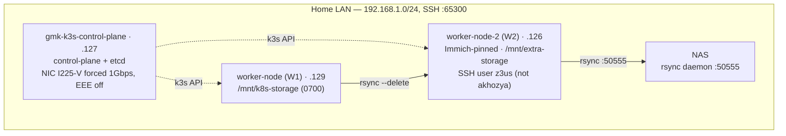
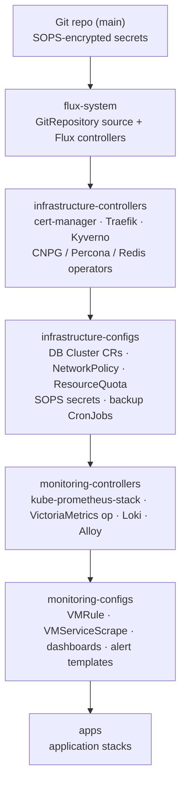
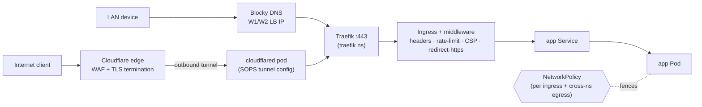
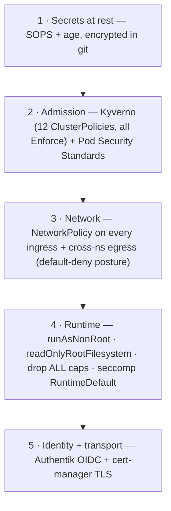

# Homelab Architecture

**What this is:** the *why* and the *shape* of the cluster — design principles, the diagrams, and the rationale behind each convention. For the current numbers see [HOMELAB_ANALYSIS.md](HOMELAB_ANALYSIS.md); for refreshed component snapshots see [CODEMAPS/](CODEMAPS/); for the changelog see [HOMELAB_HISTORY.md](HOMELAB_HISTORY.md). This file changes only when the *design* changes, not when counts drift.

**Cluster in one line:** single-environment K3s (v1.35.x, 3 Arch nodes) run as GitOps — Git is the only write path, Flux reconciles, every secret is SOPS-encrypted, every workload is admission-gated and network-fenced.

---

## Design principles (the logic)

1. **Git is the only source of truth.** No `kubectl edit/patch/apply` against live objects — the cluster is whatever `main` says. A change is a commit; Flux reconciles it in ≤60s. This makes the cluster reproducible, auditable (git log = change log), and self-healing (drift is reverted on the next reconcile). The cost — no out-of-band hotfix — is accepted deliberately.
2. **Layered reconciliation, infra before apps.** Resources have a dependency order (CRDs before custom resources, operators before the things they manage, databases before the apps that connect). Flux `dependsOn` + `wait: true` encodes it as a 6-stage chain so apps never reconcile against a half-built platform.
3. **Secrets are git-native, encrypted at rest.** SOPS + age keeps secrets *in* the repo (one source of truth, PR-reviewable) but unreadable without the cluster's age key. No external secret store to bootstrap or keep available.
4. **Defense in depth, default-deny.** Four independent layers (admission, network, runtime, identity) each assume the others may fail. A compromised app still hits a NetworkPolicy wall, a non-root RoRFS container, and Kyverno-enforced limits.
5. **Two front doors, no port-forwards.** Internal traffic stays on the LAN (fast, Blocky DNS → Traefik). External traffic enters only through a Cloudflare Tunnel (outbound-initiated — no inbound ports opened on the router). The LAN is never exposed directly.
6. **Pin everything, name things after what they are.** Images pinned to `major.minor.patch-variant` (floating tags drift silently). DB role name = app name. These conventions let humans and policy reason about the cluster without lookups.

---

## Node topology + storage

Storage is `local-path-provisioner` (node-local PVs — no distributed storage layer by choice; simpler, faster, and the backup chain provides durability instead). Immich is pinned to W2 by mtime affinity because its library lives on `/mnt/extra-storage`. Durability comes from the **replication chain W1 → W2 → NAS**, not from replicated volumes.

---

## GitOps reconciliation order

Each arrow is a hard `dependsOn` with `wait: true` — a stage only starts once the previous one reports Ready. Why this exact order:

| Stage | Owns | Must precede next because |
|---|---|---|
| `infrastructure-controllers` | Operators + CRDs (cert-manager, Traefik, Kyverno, CNPG/Percona/Redis) | CRs in the next stage need their CRDs registered + operators running |
| `infrastructure-configs` | DB `Cluster` CRs, NetworkPolicies, quotas, secrets, backups | Databases + network fences must exist before workloads use them |
| `monitoring-controllers` | Metrics/logging stack (VictoriaMetrics, Loki, Alloy) | Scrape/alert configs need the CRDs + operators |
| `monitoring-configs` | Scrapes, rules, dashboards | — |
| `apps` | 16 application stacks | Apps `dependsOn` everything above (DBs, ingress, policy, observability) |

**Consequence for DB provisioning:** a CNPG `Database` CR is *infrastructure*, not app config — it belongs in `infrastructure-configs`, in the `databases` namespace alongside its `Cluster` (the CR's `spec.cluster` is a same-namespace `LocalObjectReference`). This is why DB manifests live under `infrastructure/configs/.../databases/postgres/`, not in app dirs (F-15, 2026-05-27).

---

## Traffic flow — two front doors

An externally-reachable app has **two ingress rules** (internal hostname + Cloudflare hostname) but **one NetworkPolicy**. cert-manager issues TLS via DNS-01 (Cloudflare API token) for `*.h0melab.work`. The Cloudflare Tunnel is outbound-initiated, so the home router opens **zero** inbound ports.

---

## Security layers (defense in depth)

Each layer is independent: bypassing admission still leaves the network fence; escaping the network still leaves a non-root, read-only-rootfs container. **PSS** sets the namespace floor (`restricted` where possible, `baseline`/`privileged` only where a workload genuinely needs hostPath/host-namespaces/GPU — each justified, see F-45). **Kyverno** enforces the per-workload specifics PSS can't (image pinning, resource limits on *every* container including init, NetworkPolicy presence). NetworkPolicy ports are **container ports, not service ports**.

---

## Data layer

| Engine | Operator | Notes |
|---|---|---|
| PostgreSQL | CloudNativePG (`main-postgres`) | Shared cluster; per-app `Database` CR + role; PgBouncer pooler; role name = app name |
| MySQL | Percona | Per-app `User` CR; HAProxy front |
| CouchDB | Helm | |
| Redis | Operator (OT) | In-memory; Authentik uses Postgres-only (no Redis) |

Backups: per-engine CronJobs in `infrastructure-configs` → the W1→W2→NAS replication chain. DR runbook in [`.backup/README.md`](../.backup/README.md). Never force-delete a DB pod or drop a DB directly — go through the CRD + `kubectl rollout restart`.

---

## Single-environment reality

The tree has `base/` + `staging/` overlays (the canonical Flux monorepo shape) but there is **only `staging`** — no production. The `staging/` overlays are honest about being the one and only environment; the base/overlay split is kept because it costs little and leaves the door open, not because a second environment exists. Collapsing the passthrough indirection is tracked (F-13/F-14) but deliberately deferred — re-discovery/prune risk on a live single env outweighs the tidiness gain.

---

## Deliberate simplifications (cut corners)

Called out so they are choices, not accidents:

- **Diagrams are logical, not exhaustive.** Individual apps (16), every NetworkPolicy (~44 live), and every namespace (27) are not drawn — the [codemaps](CODEMAPS/) carry the full enumeration. This file shows the *pattern*.
- **No formal threat model.** Trust boundaries are implicit: LAN is semi-trusted, Cloudflare edge is the only external entry, pod-to-pod is default-deny. A written threat model is not maintained.
- **No distributed storage / no HA control plane.** Single CP node, node-local PVs. Durability is backup-based (replication chain), not replica-based. A CP outage stops reconciliation until the node returns; running workloads keep serving.
- **Counts live in other docs.** This file avoids hard numbers that drift; where one appears it is approximate and the codemap/ANALYSIS is authoritative.
- **Monitoring + backup internals are summarized.** Full detail in [CODEMAPS/monitoring.md](CODEMAPS/monitoring.md) and [CODEMAPS/backup-restore.md](CODEMAPS/backup-restore.md).

---

## Map of the docs

| Doc | Answers |
|---|---|
| **ARCHITECTURE.md** (this) | How is it organized and *why* |
| [HOMELAB_ANALYSIS.md](HOMELAB_ANALYSIS.md) | Current state + open action items (live counts) |
| [CODEMAPS/](CODEMAPS/) | Refreshed structural snapshots per domain |
| [HOMELAB_HISTORY.md](HOMELAB_HISTORY.md) | Append-only changelog |
| [REVIEW.md](../REVIEW.md) | Ultrareview backlog + decisions |
| [.backup/README.md](../.backup/README.md) | DR runbook |
| [SECRETS_ROTATION.md](SECRETS_ROTATION.md) | Rotation schedule |
