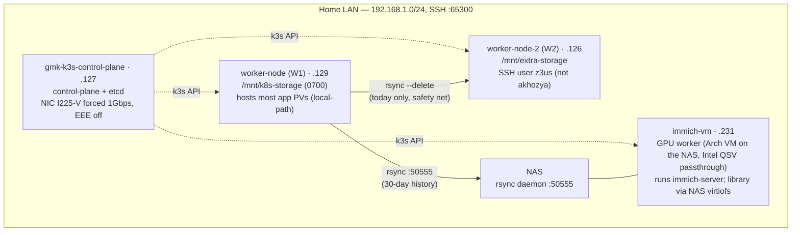
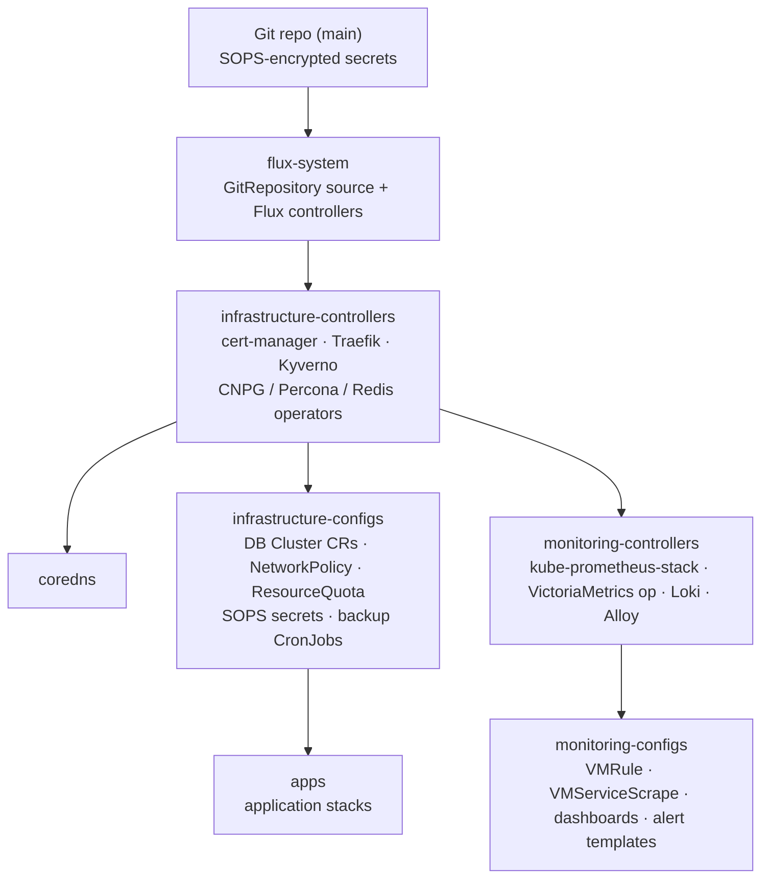
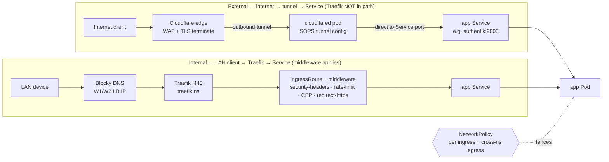
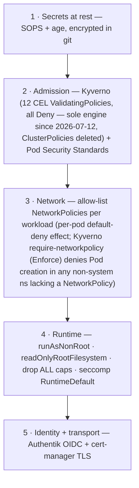

# Homelab Architecture

**What this is:** the *why* and the *shape* of the cluster — design principles, the diagrams, and the rationale behind each convention. For the current numbers see [HOMELAB_ANALYSIS.md](HOMELAB_ANALYSIS.md); for refreshed component snapshots see [CODEMAPS/](CODEMAPS/); for the changelog see [HOMELAB_HISTORY.md](HOMELAB_HISTORY.md). This file changes only when the *design* changes, not when counts drift.

**Cluster in one line:** single-environment K3s (v1.36.x, 4 Arch nodes — 3 physical + 1 GPU-worker VM on the NAS) run as GitOps — Git is the only write path, Flux reconciles, every secret is SOPS-encrypted, every workload is admission-gated and network-fenced.

---

## Design principles (the logic)

1. **Git is the only source of truth.** No `kubectl edit/patch/apply` against live objects — the cluster is whatever `main` says. A change is a commit; Flux reconciles it in ≤60s. This makes the cluster reproducible, auditable (git log = change log), and self-healing (drift is reverted on the next reconcile). The cost — no out-of-band hotfix — is accepted deliberately.
2. **Layered reconciliation, infra before apps.** Resources have a dependency order (CRDs before custom resources, operators before the things they manage, databases before the apps that connect). Flux `dependsOn` encodes it as a dependency graph rooted at the controllers — DNS, infra configs (→ apps), and monitoring branch off in parallel — so apps never reconcile against a half-built platform.
3. **Secrets are git-native, encrypted at rest.** SOPS + age keeps secrets *in* the repo (one source of truth, PR-reviewable) but unreadable without the cluster's age key. No external secret store to bootstrap or keep available.
4. **Defense in depth, default-deny.** Four independent layers (admission, network, runtime, identity) each assume the others may fail. A compromised app still hits a NetworkPolicy wall, a non-root RoRFS container, and Kyverno-enforced limits.
5. **Two front doors, no port-forwards.** Internal traffic stays on the LAN (fast, Blocky DNS → Traefik). External traffic enters only through a Cloudflare Tunnel (outbound-initiated — no inbound ports opened on the router). The LAN is never exposed directly.
6. **Pin everything, name things after what they are.** Images pinned to `major.minor.patch-variant` (floating tags drift silently). DB role name = app name. These conventions let humans and policy reason about the cluster without lookups.

---

## Node topology + storage

Storage is `local-path-provisioner` (node-local PVs — no distributed storage layer by choice; simpler, faster, and the backup chain provides durability instead). Each PV is bound to the node where it was first allocated via the PV's `nodeAffinity` (the local-path mechanism) — there is no Deployment-level node pinning. **Immich split since the 2026-07-12 Path-B cutover**: immich-server runs on the `immich-vm` GPU worker with the photo library on NAS storage via a virtiofs hostPath (the old W1 `immich-library` PV is retired from serving); the ML PV (`...immich-machine-learning`) stays W1-bound, so ML still follows W1. Durability comes from the **nightly replication fan-out from W1** (one CronJob on W1 syncs → W2 with `--delete` as a single-day safety net AND → NAS for 30-day history — not a serial W1→W2→NAS chain), not from replicated volumes.

---

## GitOps reconciliation order

`flux-system` is the Git source; `infrastructure-controllers` is the root Kustomization, and three branches hang off it — DNS, infra configs (→ apps), and monitoring. It is a dependency graph, not a single chain:

Each edge is a Flux `dependsOn`: a Kustomization waits for its parent to report Ready before it reconciles. The `apps` and `monitoring` branches are independent and reconcile in parallel once their prerequisites are met. `apps` is `wait: false` (it depends on `infrastructure-configs` being Ready, but Flux doesn't health-gate the whole apps stage — each app carries its own readiness).

| Kustomization | Depends on | Owns |
|---|---|---|
| `infrastructure-controllers` | flux-system (source) | Operators + CRDs (cert-manager, Traefik, Kyverno, CNPG/Percona/Redis) |
| `coredns` | infrastructure-controllers | Cluster DNS |
| `infrastructure-configs` | infrastructure-controllers | DB `Cluster` CRs, NetworkPolicies, quotas, secrets, backups |
| `apps` | infrastructure-configs | 16 application stacks — DBs + network fences must exist first |
| `monitoring-controllers` | infrastructure-controllers | Metrics/logging stack (VictoriaMetrics, Loki, Alloy) |
| `monitoring-configs` | monitoring-controllers | Scrapes, rules, dashboards, alert templates |

**Consequence for DB provisioning:** a CNPG `Database` CR is *infrastructure*, not app config — it belongs in `infrastructure-configs`, in the `databases` namespace alongside its `Cluster` (the CR's `spec.cluster` is a same-namespace `LocalObjectReference`). This is why DB manifests live under `infrastructure/configs/.../databases/postgres/`, not in app dirs.

---

## Traffic flow — two front doors (different paths to the same Pod)

An externally-reachable app has **two ingress rules** (internal hostname + Cloudflare hostname) but **one NetworkPolicy**. cert-manager issues TLS via DNS-01 (Cloudflare API token) for `*.h0melab.work`. The Cloudflare Tunnel is outbound-initiated → home router opens **zero** inbound ports.

**Consequence (often missed):** Traefik middleware applies **only on the internal path.** External traffic via Cloudflare Tunnel hops `cloudflared → Service` directly (per `infrastructure/configs/cloudflare/networkpolicy.yaml`: per-app `Service:port` egress to 9 apps, zero egress to the `traefik` namespace). Externally-reached apps get Cloudflare's WAF + TLS, **not** the Traefik CSP/headers/rate-limit middlewares. The tier-based CSP rollout therefore covers internal browsing only; CF-tunnel browsers see whatever CSP the app itself sets.

---

## Security layers (defense in depth)

Each layer is independent: bypassing admission still leaves the network fence; escaping the network still leaves a non-root, read-only-rootfs container. **PSS** sets the namespace floor (`restricted` where possible, `baseline`/`privileged` only where a workload genuinely needs hostPath/host-namespaces/GPU — each justified). **Kyverno** enforces the per-workload specifics PSS can't (image pinning, resource limits on *every* container including init, NetworkPolicy presence). NetworkPolicy ports are **container ports, not service ports**.

---

## Data layer

| Engine | Operator | Notes |
|---|---|---|
| PostgreSQL | CloudNativePG (`main-postgres`) | Shared cluster; per-app `Database` CR + role; PgBouncer pooler; role name = app name |
| MySQL | Percona | Per-app `User` CR; HAProxy front |
| CouchDB | Helm | |
| Redis | Operator (OT) | In-memory; Authentik uses Postgres-only (no Redis) |

Backups: per-engine CronJobs in `infrastructure-configs` → nightly replication fan-out from W1 (→ W2 safety net, → NAS 30-day history). DR runbook in [`.backup/README.md`](../.backup/README.md). Never force-delete a DB pod or drop a DB directly — go through the CRD + `kubectl rollout restart`.

---

## Failure modes (what breaks when X dies)

| Failure | Effect | What still works | Recovery |
|---|---|---|---|
| CP node down | Flux reconcile + admission paused; new pods can't schedule | Running pods + Services keep serving (kube-proxy on workers is independent) | Reboot CP; Flux catches up |
| worker-node (W1) down | **W1 is the state + durability node**: bulk of app PVCs (local-path node-bound; Immich ML PV still here — the server moved to `immich-vm` 2026-07-12), all 6 backup CronJobs (nodeSelector-pinned to W1), and Loki live there → most stateful apps + logs + the entire backup chain down (no failover; local-path is node-bound) | Stateless/other-node workloads; metrics + alerting (on W2); immich-server (on `immich-vm`, minus ML) | Reboot/replace; stateful apps + backups resume when W1 returns |
| immich-vm down (VM on the NAS) | Immich web/API down (server pod pinned there for GPU) | Everything else; Immich data safe (library on NAS storage, DB on CNPG) | `immich-vm-heal` watchdog `virsh start`s a `shut off` domain; wedges = operator-supervised (never `virsh destroy` — GPU reset-bug) |
| worker-node-2 (W2) down | **All metrics + alerting blind**: the single VMSingle instance's PV is node-bound to W2. Monitoring is self-blind on its own loss — the Watchdog dead-man alert routes to null, so nothing pages about the blindness | Apps, logs, and backups on W1 unaffected | Reboot/replace; monitoring resumes when W2 returns |
| Cloudflare edge or tunnel down | Externally-published apps unreachable | LAN access via Traefik fully unaffected | Wait CF; LAN keeps working |
| Authentik down | SSO apps lose login | Non-SSO apps; non-OIDC paths | Restart Authentik Pod or rollout |
| GitHub down | No new commits reconciled | Cluster state frozen at last sync; everything keeps running | Wait GitHub |
| Age key (`sops-age` Secret in flux-system) lost | Encrypted secrets unreadable; new SOPS reconciles fail | Already-applied secrets in etcd keep working | Restore key from secure backup (NOT in this repo) |

## Single-environment reality

This is a single-environment cluster — and that environment is **production** (the live homelab). There is no separate staging and no promotion pipeline: a merge to `main` deploys straight to prod. The repo once carried the canonical Flux `base/` + `staging/` overlay shape, but with one and only one environment the split was pure ceremony (overlays were `[../base]` + SOPS secrets — no patches, replicas, or image overrides), and the `staging/` dir name was a Flux-convention artifact, not a second environment. It has been **fully collapsed to flat single-env dirs**: apps (2026-05-29), infra + monitoring controllers, and the configs layer (2026-06-04). Every move was proven render byte-identical (`kustomize build` oracle-diff empty) → Flux re-adopted every object in place, zero churn. **No `base/staging` overlay split remains repo-wide;** a new such split is now the smell, not the norm.

---

## Deliberate simplifications (cut corners)

Called out so they are choices, not accidents:

- **Diagrams are logical, not exhaustive.** Individual apps, NetworkPolicies, and namespaces are not drawn — the [codemaps](CODEMAPS/) and [HOMELAB_ANALYSIS](HOMELAB_ANALYSIS.md) carry the enumeration and counts. This file shows the *pattern*.
- **No offsite backup (3-2-1 ceiling).** W1, W2, and the NAS share one building, power feed, and LAN — a whole-site event (fire, surge, theft) loses every copy at once. No cloud/offsite copy by choice; accepted risk ceiling.
- **Monitoring is single-node and self-blind.** One VMSingle instance, PV node-bound to W2 → W2 loss blinds all metrics + alerting, and the Watchdog dead-man alert routes to null, so nothing pages about the blindness. Accepted.
- **No formal threat model.** Trust boundaries are implicit: LAN is semi-trusted, Cloudflare edge is the only external entry, pod-to-pod is default-deny. A written threat model is not maintained.
- **No distributed storage / no HA control plane.** Single CP node, node-local PVs. Durability is backup-based (replication chain), not replica-based. A CP outage stops reconciliation until the node returns; running workloads keep serving.
- **Counts live in other docs.** This file avoids hard numbers that drift; where one appears it is approximate and the codemap/ANALYSIS is authoritative.
- **Monitoring + backup internals are summarized.** Full detail in [CODEMAPS/monitoring.md](CODEMAPS/monitoring.md) and [CODEMAPS/backup-restore.md](CODEMAPS/backup-restore.md).
- **OIDC redirect flow not in the traffic diagram.** SSO apps bounce through Authentik (`/oauth2/*`) on first login; the diagram shows the steady-state request path only.
- **CNI / kube-proxy / cluster-internal pod networking not drawn.** Pod-to-pod via CoreDNS (`kube-system`) + flannel + ClusterIP DNAT is assumed; the 2026-05-24 ClusterIP wedge incident proves this layer matters operationally even if it's invisible here.
- **Node + CoreDNS *external* DNS upstream not drawn.** Nodes and CoreDNS resolve external names via public resolvers (1.1.1.1/9.9.9.9), decoupled from Blocky since 2026-06-04 to break a node→Blocky→kube-proxy circular dep; Blocky serves LAN clients only. See [CODEMAPS/networking.md](CODEMAPS/networking.md).
- **Operator-created NetworkPolicies not enumerated.** Live `kubectl get netpol -A` shows more than git contains — the delta is operators (CNPG, Kyverno) creating their own plus component-generated policies. Codemap counts the file-level breakdown.
- **Age-key bootstrap not drawn.** The decryption chain is: `sops-age` Secret in `flux-system` → kustomize-controller reads it → decrypts SOPS-encrypted manifests on apply. Lose the key and you can't reconcile new secrets (see Failure modes).
- **Cluster boundary is implicit.** In-scope: the 4 nodes + the workloads they run (incl. the `immich-vm` guest OS). Out-of-scope but referenced: the NAS appliance itself (backup sink + `immich-vm` hypervisor), the home router (forwards nothing inbound — CF tunnel is outbound), the Cloudflare edge.
- **Reconcile cascade timing not in diagrams.** Full chain ~5 min post-push; not worth drawing.

---

## Map of the docs

| Doc | Answers |
|---|---|
| **ARCHITECTURE.md** (this) | How is it organized and *why* |
| [HOMELAB_ANALYSIS.md](HOMELAB_ANALYSIS.md) | Current state + open action items (live counts) |
| [CODEMAPS/](CODEMAPS/) | Refreshed structural snapshots per domain |
| [HOMELAB_HISTORY.md](HOMELAB_HISTORY.md) | Append-only changelog |
| [.backup/README.md](../.backup/README.md) | DR runbook |
| [SECRETS_ROTATION.md](SECRETS_ROTATION.md) | Rotation schedule |
