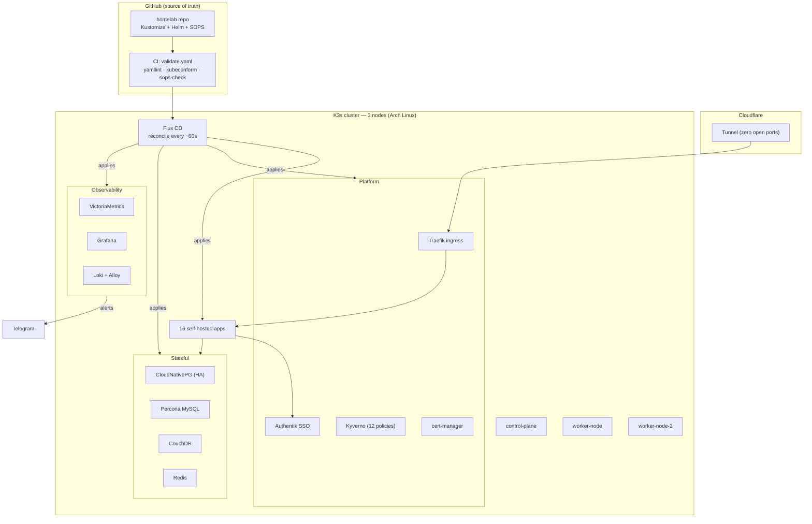

# Homelab Docs Showcase Implementation Plan

> **For agentic workers:** REQUIRED SUB-SKILL: Use superpowers:executing-plans (inline, batch-with-checkpoints) to implement this plan stage-by-stage. Steps use checkbox (`- [ ]`) syntax. A human review checkpoint ends every stage — STOP and surface a diff/preview before committing.

**Goal:** Turn the homelab repo's docs from internal agent-runbooks into public-portfolio-quality documentation that showcases DevOps skill at a glance, while keeping every fact accurate and every load-bearing config untouched.

**Architecture:** README becomes the front door (hero → badges → architecture diagram → tech stack → apps → how-GitOps-works → repo map → docs index). Deep docs get a human voice and lose agent jargon. Topology stays concrete; only personal email + leftover secret refs are scrubbed. Work happens in worktree `wt-docs-showcase`, merged to `main` only after the full review.

**Tech Stack (subject of the docs):** K3s, Flux CD (GitOps), CloudNativePG, Percona MySQL, CouchDB, Redis, VictoriaMetrics + Grafana + Loki + Alloy, Authentik (SSO), Traefik + Cloudflare Tunnel, Kyverno, SOPS/age, Renovate, cert-manager.

---

## Decisions (locked, from brainstorming)

| Decision | Choice |
|---|---|
| Audience | Public portfolio — recruiters/peers/homelabbers |
| AI tooling | Keep but don't feature. CLAUDE.md + `.claude/**` UNTOUCHED. Zero agent jargon in reader-facing docs. No AI-ops showcase section. |
| Topology | Keep IPs/hostnames/domain. Scrub personal email + any leftover secret refs only. |
| New artifacts | Mermaid architecture diagram (in README + ARCHITECTURE.md), shields.io badges, screenshot placeholder slots. NO LICENSE, NO getting-started guide. |
| Grade theater | DROP the self-assigned "A+ 97/100" letter grades. Keep an honest posture table. |
| HISTORY scope | Readable intro + heading de-jargon pass only. NOT a full 2028-line rewrite. Keep SHAs/dates. |

---

## Verified facts (cite these; do not repeat stale numbers)

- **Apps: 16** — audiobookshelf, authentik (SSO), blocky (DNS), claude-telegram, home-assistant, homehub, homepage, immich, linkwarden, mealie, n8n, obsidian, paperless-ngx, pricebuddy, stirling-pdf, uptime-kuma. (`apps/components` is a Kustomize component, NOT an app.)
- **Nodes: 3** — 1 control-plane (`gmk-k3s-control-plane`, 192.168.1.127), 2 workers (`worker-node` .129, `worker-node-2` .126). Arch Linux. SSH on :65300.
- **K3s: v1.36.1+k3s1** (verify current at Stage 0 — may have moved).
- **Databases: 4 engines** — PostgreSQL (CloudNativePG, HA), MySQL (Percona), CouchDB (Obsidian sync), Redis (Immich cache). Confirm HA replica counts per engine at Stage 2.
- **Kyverno: 12 ClusterPolicies** — disallow-host-path, disallow-privilege-escalation, require-networkpolicy, require-non-default-serviceaccount, disallow-latest-tag, require-seccomp-runtimedefault, require-labels, require-non-root, require-readonly-rootfs, require-resource-limits, disallow-host-namespaces, require-drop-all-capabilities.
- **Flux Kustomization order:** flux-system → coredns → infrastructure-controllers → infrastructure-configs → apps → monitoring-controllers → monitoring-configs. VERIFY exact `dependsOn` edges from `clusters/**` at Stage 2 (CLAUDE.md states a different order — trust the YAML, not CLAUDE.md).
- **CI:** `.github/workflows/validate.yaml` = gate-of-record (yamllint + shellcheck + sops-check + init-resources + kubeconform ×5 kustomize roots, ~45s p95). Other workflows: `flux-update.yaml`, `renovate-analysis.yaml`, `claude.yml`, `claude-telegram-build.yml`.
- **Infra controllers:** cert-manager, csp-reporter, databases (CNPG/Percona operators), kyverno, priority-classes, traefik, coredns.
- **Repo origin:** github.com/AKhozya/homelab

---

## Conventions for every stage

- **Worktree only.** All edits under `.claude/worktrees/docs-showcase/`. Never touch the main checkout.
- **Commits:** single-line, no AI/Claude mention (global rule). One commit per stage unless a stage says otherwise.
- **Markdown house style (global CLAUDE.md):** every line changes what the reader knows/does; no decorative emoji; bold the one lookup keyword; drop intensifiers (comprehensive/robust/significantly/simply); tables over paragraphs for enumerable facts; KEEP the why, gotchas, repro commands, dates, SHAs. For PUBLIC docs, relax terseness enough for a human voice — explain the *why*, but no fluff.
- **De-jargon term list** (replace in reader-facing docs): caveman, cavecrew, superpowers, "skill"/"skills" (agent sense), "memory"/`ctx_*`, ultrareview/UR1/UR2, worktree-guard, "PostToolUse/PreToolUse hook", "Claude no sudo", `/homelab-node-fix`, `/gitops-workflow` (as a slash command). Translate to neutral ops language: "automated review", "CI validation", "GitOps workflow", "agent-assisted ops" (only where genuinely needed, never as a feature).
- **DO NOT TOUCH:** `CLAUDE.md`, `.claude/**` (skills/hooks/agents/review-invariants), `apps/*/` YAML, any non-doc file. Docs-only change.
- **PII scrub:** remove `<admin-email>` (any case). KEEP IPs/hostnames/domain `h0melab.work`.
- **Verification per stage** (replaces TDD): (a) `grep -rin 'alexander.khozya' docs README.md` → empty; (b) de-jargon grep → empty in target files; (c) markdown link integrity on changed files; (d) every cited number traces to Verified-facts or a fresh repo query; (e) `git diff --stat` sanity.

---

## Stage 0: Worktree setup + fact-finishing + PII scrub

**Status:** worktree `wt-docs-showcase` already created at `.claude/worktrees/docs-showcase`.

**Files:**
- Modify: any doc containing `<admin-email>`
- Create: `docs/images/.gitkeep` (placeholder dir for screenshots)

- [ ] **Step 1: Finish fact-gathering.** Run and record:

```bash
# current k3s version pin
grep -rhoE 'v1\.[0-9]+\.[0-9]+\+k3s[0-9]+' docs infrastructure 2>/dev/null | sort -u | tail -1
# CNPG/Percona/redis replica counts
grep -rE 'instances:|replicas:|size:' infrastructure/configs/databases apps/immich 2>/dev/null
# exact dependsOn edges
grep -rB2 -A4 'dependsOn' clusters/ 2>/dev/null
# monitoring stack components
ls monitoring/controllers monitoring/configs 2>/dev/null
```

Expected: concrete versions/counts/edges to cite in later stages. Append findings to the Verified-facts list (edit this plan file in place).

- [ ] **Step 2: Locate every personal-email hit.**

```bash
grep -rin 'alexander.khozya' . --include='*.md' | grep -v '.claude/'
```

Expected: list of files+lines (assessment flagged `docs/archive/cloudflare-gateway-setup.md` ~L16; confirm full list).

- [ ] **Step 3: Scrub each hit.** Replace the email with `<admin-email>` (or delete the line if it only exists as a contact note). Use Edit per file.

- [ ] **Step 4: Create screenshot dir.**

```bash
mkdir -p docs/images && touch docs/images/.gitkeep
```

- [ ] **Step 5: Verify scrub + sweep for other leftover secret-looking refs.**

```bash
grep -rin 'alexander.khozya' . --include='*.md' | grep -v '.claude/'   # expect empty
grep -rinE 'BEGIN (RSA|OPENSSH|EC) PRIVATE KEY|bot[0-9]{8,}:[A-Za-z0-9_-]{30,}|sk-[A-Za-z0-9]{20,}' docs README.md   # expect empty
```

Expected: both empty.

- [ ] **Step 6: REVIEW CHECKPOINT.** Show user: email-hit list + scrub diff + any other secret-looking finding. Get OK.

- [ ] **Step 7: Commit.**

```bash
git add -A && git commit -m "docs: scrub personal email, add screenshot dir"
```

---

## Stage 1: README rewrite + architecture diagram + badges

**Files:**
- Modify: `README.md` (full rewrite)

- [ ] **Step 1: Draft the new README** with these sections, in order:

1. **Title + hero line** — e.g. `# Homelab` / one sentence: a fully-declarative 3-node K3s cluster running 16 self-hosted apps, managed end-to-end by GitOps (Flux), with default-deny networking, SOPS-encrypted secrets, automated DB backups, and SSO.
2. **Badges row** (shields.io, static + dynamic):

```markdown


```

3. **Architecture diagram** (Mermaid — concrete starting point, refine against verified facts):



4. **Highlights** — 5-7 bullets answering "why is this interesting": everything declarative (no `kubectl apply` by hand), 100% Pod Security Standards + 12 Kyverno enforce policies, default-deny NetworkPolicies (every ingress paired), HA Postgres with automated daily logical backups + documented DR, single-sign-on across apps via Authentik, image-pinned + Renovate-automated updates, CI gate on every push.
5. **Tech stack table** grouped: Platform / GitOps / Ingress & DNS / Databases / Observability / Security / Backup — tool + role columns.
6. **Hardware table** — 3 nodes: name, role, IP, notes.
7. **Apps table** — 16 rows: app, purpose, auth (SSO/none), external (tunnel y/n). Pull truth from `apps/`.
8. **How GitOps works here** — the reconcile loop + the Kustomization dependency chain (verified order), 3-4 sentences + the chain as a code block.
9. **Repo structure** — top-level dir tree with one-line purpose each (`apps/`, `infrastructure/`, `monitoring/`, `clusters/`, `docs/`, `.backup/`).
10. **Screenshots** — placeholder slots: `<!--  -->` with a one-line "drop screenshots here" note.
11. **Docs index** — linked list to the deep docs (ARCHITECTURE, SECURITY, FIREWALL_SECURITY, BACKUP_STRATEGY, disaster-recovery, SECRETS_ROTATION, CODEMAPS, HOMELAB_HISTORY).
12. **Footer** — honest note: personal homelab, deliberate trade-offs (not 100% HA), links to ARCHITECTURE "cut corners".

- [ ] **Step 2: Write `README.md`** with the drafted content. Every number from Verified-facts.

- [ ] **Step 3: Verify.**

```bash
# de-jargon clean
grep -inE 'caveman|cavecrew|superpowers|ultrareview|worktree-guard' README.md   # expect empty
# links resolve (manual: each docs/ link points to an existing file)
grep -oE '\]\(([^)]+)\)' README.md | grep -oE '\(([^)]+)\)' | tr -d '()' | grep -vE '^http|^#|^<!--' | while read -r p; do [ -e "$p" ] || echo "MISSING: $p"; done   # expect empty
```

Expected: both empty.

- [ ] **Step 4: REVIEW CHECKPOINT.** Show user full rendered README preview (or the file). Iterate on hero/diagram/tables until approved.

- [ ] **Step 5: Commit.**

```bash
git add README.md && git commit -m "docs: rewrite README as public showcase with architecture diagram + badges"
```

---

## Stage 2: Core docs — ARCHITECTURE, ANALYSIS→Overview, SECURITY, FIREWALL

**Files:**
- Modify: `docs/ARCHITECTURE.md`, `docs/HOMELAB_ANALYSIS.md`, `docs/SECURITY.md`, `docs/FIREWALL_SECURITY.md`

- [ ] **Step 1: ARCHITECTURE.md.** Embed the (refined) Mermaid diagram near the top. Verify the `dependsOn` edges and fix the dependency-order description to match `clusters/**`. Tighten prose to a human voice. Spotlight two sections recruiters value: **Design principles** (why GitOps/why default-deny/why pinned images) and **Cut corners / trade-offs** (deliberate non-HA choices). De-jargon.

- [ ] **Step 2: HOMELAB_ANALYSIS.md → System Overview.** Update the title/intro to read as a system overview, not an agent state-tracker. DELETE the "A+ 97/100" letter-grade block and per-category score theater. Replace with an honest **posture table** (Security / Backup-DR / Observability / Automation → short factual status, no invented score). Strip all ultrareview/UR/agent-meta lines. Keep the real content: app inventory, security controls, what's monitored.

- [ ] **Step 3: SECURITY.md.** Add a 2-3 sentence human intro framing the security model (defense-in-depth: PSS + Kyverno + NetworkPolicy + SOPS + tunnel). De-jargon. Keep concrete topology and the control inventory. Verify control counts (12 policies) match reality.

- [ ] **Step 4: FIREWALL_SECURITY.md.** Human intro on the UFW + NetworkPolicy two-layer model. De-jargon. Keep IPs/ports (they showcase the actual ruleset).

- [ ] **Step 5: Verify.**

```bash
grep -rinE 'caveman|cavecrew|superpowers|ultrareview|UR1|UR2|worktree-guard|Claude no sudo' docs/ARCHITECTURE.md docs/HOMELAB_ANALYSIS.md docs/SECURITY.md docs/FIREWALL_SECURITY.md   # expect empty
grep -in '97/100\|A+\|94/100' docs/HOMELAB_ANALYSIS.md   # expect empty (grade theater gone)
```

Expected: both empty.

- [ ] **Step 6: REVIEW CHECKPOINT.** Show user diffs per file. Approve.

- [ ] **Step 7: Commit.**

```bash
git add docs/ARCHITECTURE.md docs/HOMELAB_ANALYSIS.md docs/SECURITY.md docs/FIREWALL_SECURITY.md
git commit -m "docs: humanize architecture + security docs, drop self-grade theater"
```

---

## Stage 3: Ops docs — BACKUP_STRATEGY, disaster-recovery, SECRETS_ROTATION, CODEMAPS

**Files:**
- Modify: `docs/BACKUP_STRATEGY.md`, `docs/disaster-recovery/**`, `docs/SECRETS_ROTATION.md`, `docs/CODEMAPS/*.md`

- [ ] **Step 1: BACKUP_STRATEGY.md.** Add a narrative intro + an **RTO/RPO table** (per data tier: Postgres, MySQL, CouchDB, app PVCs → backup cadence, retention, restore target). De-jargon. Keep restore commands verbatim (load-bearing).

- [ ] **Step 2: disaster-recovery/.** Read the dir; add/refresh a short intro that frames it as the DR runbook. De-jargon. Keep all repro commands.

- [ ] **Step 3: SECRETS_ROTATION.md.** Human intro on the SOPS/age model + rotation cadence table. Scrub any example secret values (replace with `<value>`). Keep the schedule + dates.

- [ ] **Step 4: CODEMAPS refresh.** For each of the 7 CODEMAPS, fix any stale count/structure against the repo (16 apps, 12 policies, 4 DB engines, current dir tree). These stay terse reference snapshots — light touch, accuracy only.

- [ ] **Step 5: Verify.**

```bash
grep -rinE 'caveman|cavecrew|superpowers|ultrareview' docs/BACKUP_STRATEGY.md docs/SECRETS_ROTATION.md docs/disaster-recovery docs/CODEMAPS   # expect empty
grep -rinE 'BEGIN.*PRIVATE KEY|sk-[A-Za-z0-9]{20,}' docs/SECRETS_ROTATION.md   # expect empty
```

Expected: both empty.

- [ ] **Step 6: REVIEW CHECKPOINT.** Show diffs. Approve.

- [ ] **Step 7: Commit.**

```bash
git add docs/BACKUP_STRATEGY.md docs/SECRETS_ROTATION.md docs/disaster-recovery docs/CODEMAPS
git commit -m "docs: add RTO/RPO + narrative to ops docs, refresh codemaps"
```

---

## Stage 4: HISTORY intro + archive scrub + app docs

**Files:**
- Modify: `docs/HOMELAB_HISTORY.md` (light), `docs/archive/**` (scrub only), `apps/home-assistant/README.md`, `apps/home-assistant/OIDC_SETUP.md`, `apps/home-assistant/SECURITY.md`, `apps/stirling-pdf/SECURITY.md`
- Create: `docs/archive/README.md`

- [ ] **Step 1: HISTORY intro.** Add a top section: "## Milestones & notable incidents" — a short curated table (date → event → outcome) pulling the 6-8 biggest items (k3s upgrades, DNS decoupling, CNPG failover incident, security hardening waves) from the log below. De-jargon the section HEADINGS only (not every line). Keep all SHAs/dates. Do NOT rewrite the 2028-line body.

- [ ] **Step 2: archive README.** Create `docs/archive/README.md`: 3-4 lines framing `archive/` as historical implementation plans/specs kept for reference, not current state.

- [ ] **Step 3: archive scrub.** `archive/**` is reference — do NOT rewrite. Only confirm Stage-0 email scrub covered it; grep for any other secret-looking ref.

```bash
grep -rinE 'alexander.khozya|BEGIN.*PRIVATE KEY|sk-[A-Za-z0-9]{20,}' docs/archive   # expect empty
```

- [ ] **Step 4: App docs polish.** For each app doc: human intro line, de-jargon, keep setup commands. These are small — light touch.

- [ ] **Step 5: Verify.**

```bash
grep -rinE 'caveman|cavecrew|superpowers' apps/home-assistant apps/stirling-pdf/SECURITY.md docs/HOMELAB_HISTORY.md   # expect empty in app docs + history intro
```

- [ ] **Step 6: REVIEW CHECKPOINT.** Show diffs. Approve.

- [ ] **Step 7: Commit.**

```bash
git add docs/HOMELAB_HISTORY.md docs/archive apps/home-assistant apps/stirling-pdf
git commit -m "docs: add history milestones intro, archive readme, polish app docs"
```

---

## Stage 5: Final cross-doc pass + merge

**Files:** all changed docs (read-only verification) + merge to `main`

- [ ] **Step 1: Repo-wide consistency sweep.** Confirm every doc agrees on the numbers (16 apps, 3 nodes, 12 policies, 4 DB engines, k3s version). One source of truth.

```bash
grep -rinE 'apps|nodes' README.md docs/ARCHITECTURE.md docs/HOMELAB_ANALYSIS.md | grep -E '[0-9]+ (apps|nodes|self-hosted)'
```

- [ ] **Step 2: Repo-wide link integrity.** Every relative doc link resolves.

```bash
grep -rhoE '\]\(([^)h][^)]*)\)' README.md docs/*.md | tr -d '][()' | sed 's/#.*//' | sort -u | while read -r p; do [ -z "$p" ] || [ -e "$p" ] || [ -e "docs/$p" ] || echo "CHECK: $p"; done
```

- [ ] **Step 3: Final PII/secret sweep (whole repo, docs).**

```bash
grep -rin 'alexander.khozya' . --include='*.md' | grep -v '.claude/'   # expect empty
```

- [ ] **Step 4: Fresh-eyes review.** Per homelab CLAUDE.md pre-push gate, run a reviewer pass over the full doc diff (`git diff main...wt-docs-showcase -- '*.md' README.md`). For docs the focus is: factual accuracy vs repo, no leftover jargon/PII, link integrity, consistent numbers, tone. Address findings.

- [ ] **Step 5: REVIEW CHECKPOINT (final).** Show user the full `git diff --stat` + the reviewer summary. Get explicit merge approval.

- [ ] **Step 6: Merge + push.**

```bash
cd /Users/akhozya/source-code/homelab
git merge wt-docs-showcase
git push origin main
```

- [ ] **Step 7: Teardown worktree.**

```bash
git worktree remove .claude/worktrees/docs-showcase
git branch -d wt-docs-showcase
```

Note: docs-only change → no Flux reconcile / cluster impact needed. (`fr` not required.)

---

## Self-review (run after drafting, before execution)

- **Spec coverage:** every per-doc treatment from the approved design maps to a stage (README→S1, core→S2, ops→S3, history/archive/apps→S4, diagram→S1+S2, badges→S1, screenshot slots→S0+S1, PII scrub→S0+S5, grade-drop→S2, history-cap→S4). ✓
- **No placeholders:** badge markdown, Mermaid diagram, and grep verifications are concrete. Per-doc prose is described by section, not pre-written (docs prose ≠ code; exact wording is a Stage-time judgment, but each doc's required sections/changes are explicit). ✓
- **Consistency:** numbers centralized in Verified-facts; Stage 5 enforces agreement. ✓
- **No-touch list honored:** CLAUDE.md + `.claude/**` excluded from every stage. ✓
